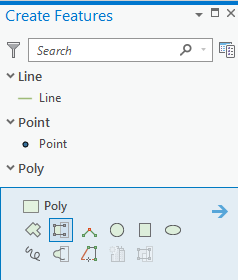
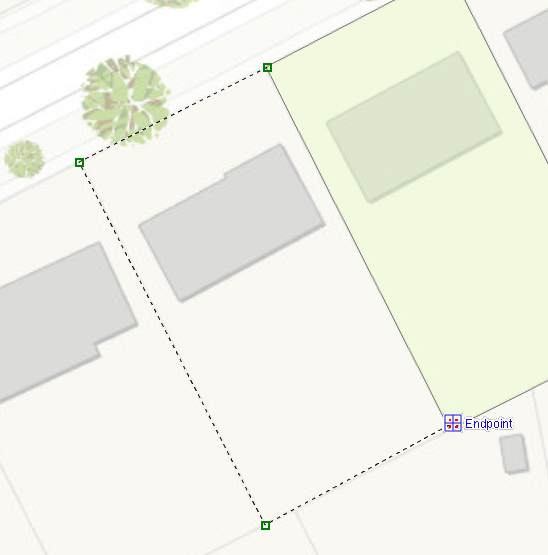
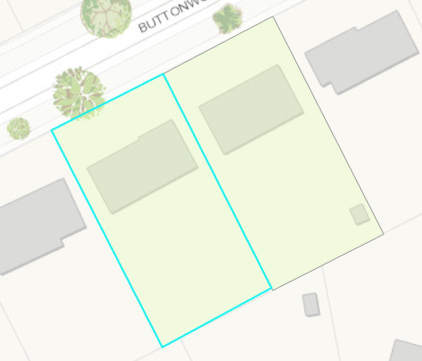
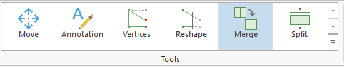
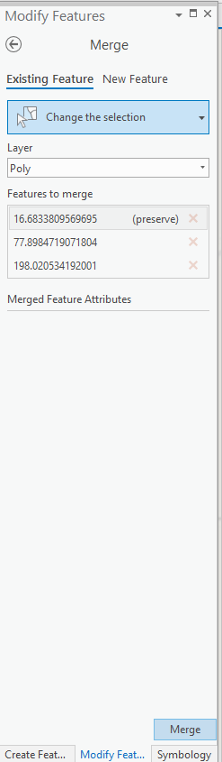
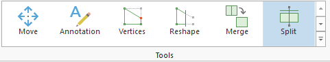
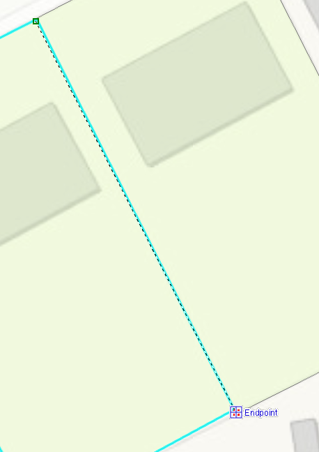
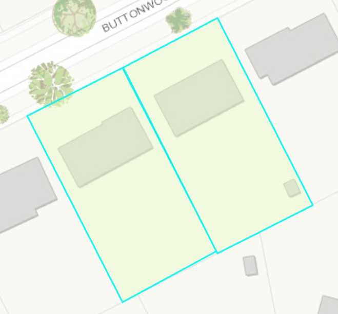
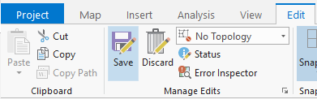
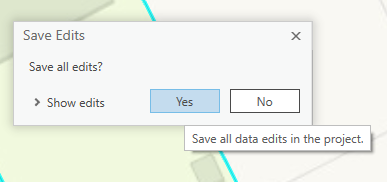

## About
Last Updated *[06/11/2019]*   
Created by [OSU Maps and Spatial Data](https://info.library.okstate.edu/map-room)

## Table of Contents
- Introduction 
- *[Editing in ArcGIS Pro]*
- - Auto-Complete Polygon
- - Merge
- - Split
- - Saving
- Conclusion
- Further Reading/Resources

## Introduction
ArcGIS Pro enables users to edit existing vector data. The three most common editing tools are auto-complete polygon, merge and split.

## *[Editing in ArcGIS Pro]*
In order to use the editing tools in ArcGIS Pro, be sure to open a project with existing vector data or create new vector data using the digitization tools. 

### Auto-Complete Polygon
Auto-complete digitizing allows a polygon to be created that abudts an existing polygon. This means the shared line does not have to be digitized more than once, which can lead to complications such a slivers. 

1. To autocomplete a polygon, open the *Create Features* pane and select **Autocomplete Polygon**.

2. Select a starting point on the existing polygon feature and outline the new feature that you would like to digitize. Be sure the end point is on the exisitng polygon feature.

3. Double click to complete the new polygon. Now two polygons have been created without duplicating a line. 

### Merge
Merge is a tool that allows different features to be combined into one.

1. To merge digitized features, click **Merge** under the *Edit* tab. 

2. A *Modify Features* pane should appear. You can select the desired features in one of two ways:
- 1. With the **Merge** tool activated, click on the first desired feature. Hold down **CTRL** on the keyboard and select the remaining features. The features will appear highlighted.
- 2. Use the mouse to draw a box around the desired features by left clicking and holding as you drag the box over the desired area. The features will appear highlighted.

3. After the features have been selected, click **Merge** in the bottom right hand corner of the *Modify Features* pane. The features are now merged into one feature. 

### Split
Splitting polygons is the opposite of merging. 

1. To split polygons, select **Split** under the *Edit* tab. 

2. Draw a line where you would like to split the existing polygon.

3. Double click at the end point to split the polygon into two seperate polygons. 

##### Saving
Be sure to save your work periodically. The save icon in the top left corner of the screen does not save digitization edits.

1. To ensure digitizing is saved, click **Save** in the *Edit* tab of the toolbar. 

2. A pop up should appear. Click **Yes** to save all edits.

## Conclusion
ArcGIS Pro offers many tools that are useful for editing data. 

## Further Reading/Resources

[Return to Top](#about)
